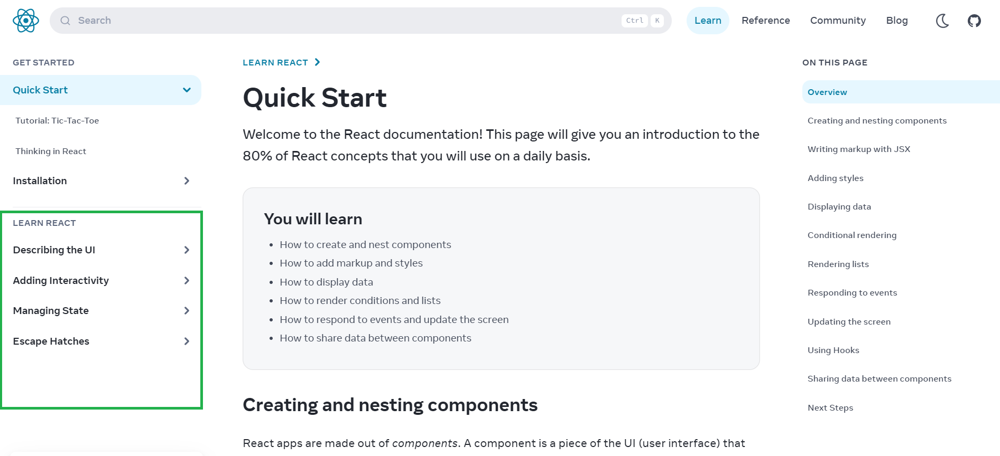

# React101

Bu repo, [React.dev](https://react.dev/learn) "Learn React" sekmesi altında dört başlıkta işlenen React.js eğitiminin *örnekleriyle beraber* ve **Türkçeleştirilmiş** halidir. Aynı zamanda kendim için oluşturduğum bir not defteridir. Bu yüzden birebir çeviri değildir. Ekleme yaptığım bölümler vardır. Eklenen kısımlar yorumlarım değil, araştırmalarımdır.



## İçerik
`src` klasörü içinde yer alan `App01.js`, `App02.js`, `App03.js`, `App04.js` dosyaları dört başlığın ayrı ayrı kapsayıcı bileşenlerini temsil eder. Bu dört başlık `src/components` klasörü içinde ayrı ayrı işlenmiş olup isimleri şunlardır:

01. Describing-the-UI
02. Adding-Interactivity
03. Managing-State
04. Escape-Hatches 

Örnekleri tarayıcı üzerinde başlatmak için, `src/index.js` Root.render() ifadesinin içine açmak istediğiniz başlığın numarasını `App{BaşlıkNumarası}` şeklinde yazıp terminal üzerinden `npm start` ile çalıştırabilirsiniz.
 
**Not:** import işlemleri index.js içerisinde tanımlanmıştır ve yorum satırına alınmıştır. Çalıştırmak istediğiniz başlığın yorum satırını kaldırınız.

*Örneğin:*
#### src/index.js

```
import App01 from './App01';
// import App02 from './App02';

root.render(
  <React.StrictMode>
    <App01 />  // Describing-the-UI componenti çalıştırılacaktır.
  </React.StrictMode>
)
```

**Yazar:**[ Samet Polat](https://www.linkedin.com/in/sametpolat7/)


